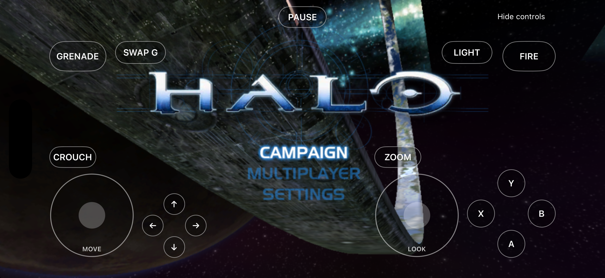

# Halo: CE for iPhone and iPad

[](https://github.com/NicholasDominici/halo-ce-ios/actions/workflows/ios.yml)

An experimental native iOS/iPadOS port of Halo: Combat Evolved, built on
[halo-ce-universal](https://github.com/cybersecurity/halo-ce-universal) and
[bnunu's native ports](https://github.com/bnunu/halo-1). Runs compiled ARM64
code with OpenGL ES 3, SDL audio, and on-screen controls. No jailbreak or JIT
is required. **You supply your own original Xbox game maps.**

**Status:** gameplay and audible sound confirmed on an iPhone 17 Pro Max
(A19 Pro). iPad has been tested in the simulator only. This is an early port;
a full campaign playthrough, physical iPad gameplay, hardware controllers,
and multiplayer still need testing. The deployment target is iOS 16, but
older devices and OS versions have not been validated.



*Simulator screenshot. The in-game developer text and build label are hidden.*

## Get the app

1. Download an **unsigned IPA** from [Releases](https://github.com/NicholasDominici/halo-ce-ios/releases),
   or the `halo-ce-ios-unsigned` artifact from a successful
   [iOS workflow run](https://github.com/NicholasDominici/halo-ce-ios/actions/workflows/ios.yml).
2. Sign and install it using your own Apple account and provisioning profile.
   An unsigned IPA cannot be installed directly. This repository does not
   provide a shared certificate or App Store/TestFlight distribution.
3. Copy your original Xbox maps into the app's `Documents/maps` folder
   **before launching the game**. See the [installation guide](port/ios/README.md#install-and-add-game-data).

For the documented Xcode signing route, build from source below. Keep the
same bundle identifier for future updates so your app data remains associated
with the app. Back up `Documents/save` before uninstalling.

## Build from source

Use an **Apple Silicon Mac**, full Xcode with the iOS SDK, and Python 3.
Local development used Xcode 27 and Homebrew LLVM/LLD 23.1.2. CI builds with
the Xcode selected on GitHub's `macos-26` ARM64 runner.

```sh
git clone --branch ios-port https://github.com/NicholasDominici/halo-ce-ios.git
cd halo-ce-ios
brew install cmake ninja llvm lld sdl3 pkgconf

# Regression checks (no game data or Apple account needed).
python3 tools/ios_test.py

# Build a device IPA for signing later.
python3 tools/ios_build.py --unsigned --ipa dist/Halo-CE-iOS-unsigned.ipa

# Or build and sign with the Apple account configured in Xcode.
python3 tools/ios_build.py --team YOUR_TEAM_ID --bundle-id com.yourname.haloce
```

The script downloads SDL, musl, and Khronos headers; it does not download game
data. Use `--simulator` for an ARM64 simulator build. See the
[full guide](port/ios/README.md) for prerequisites, installation, controls,
troubleshooting, and architecture.

## Game data

The iOS cache validator accepts original Xbox v5 maps with these build IDs:

| Release | Cache build | Coverage |
| --- | --- | --- |
| NTSC-US | `01.10.12.2276` | iPhone gameplay and audio confirmed |
| PAL | `01.01.14.2342` | Original upstream baseline; not played on iOS yet |

Inspect or extract maps from your own XISO:

```sh
python3 tools/ios_extract_assets.py '/path/to/Halo.xiso.iso'
python3 tools/ios_extract_assets.py '/path/to/Halo.xiso.iso' --output assets
```

PC, Custom Edition, Anniversary, and MCC data are not interchangeable with
these maps. The extraction tool preserves the original bytes and records
SHA-256 hashes; it does not patch map headers. No maps or disc images are
included in this repository or its releases.

## Controls and limitations

- Left stick: move. Right stick: look. Arrows: navigate menus.
- A: select/jump. B: back/melee. X: reload/use. Y: change weapon.
- Separate buttons: fire, grenade, crouch, zoom, flashlight, grenade selection,
  and pause. “Hide controls” leaves a small button to restore them.
- Hardware controller support is wired through SDL but has not been verified
  on a physical iOS device. Internet invites and clipboard joining default off.
- Bink intro movies are unsupported. Simulator rendering is slow and does
  not represent device performance. Assertions remain enabled in this initial port.

Read the [validation record](port/ios/VALIDATION.md) before reporting coverage.
For bugs, [open an issue](https://github.com/NicholasDominici/halo-ce-ios/issues)
with device model, OS, build/commit, map build ID, and reproduction steps.
Relevant excerpts from `Documents/ios-runtime.log` and `debug.txt` help;
remove personal paths, network addresses, and invite links before sharing.
Please do not upload game files or signing credentials.

## Credits and upstream

The iOS work builds on the ARM64 runtime, renderer, audio, and platform work
in [cybersecurity/halo-ce-universal](https://github.com/cybersecurity/halo-ce-universal),
[bnunu/halo-1](https://github.com/bnunu/halo-1), and the original decompilation
in [punpckhdq/halo](https://github.com/punpckhdq/halo). Their Git history is
preserved. This branch started at upstream commit `16514a13`; later upstream
changes are integrated separately from the tested iOS baseline.

The Android application, Gradle project, NDK build, and Android-only host
services have been removed from this branch. Portable ILP32 runtime code lives
in `port/runtime`; native UIKit/Darwin services live in `port/ios`. The shared
renderer and Xbox compatibility layer remain under `port/linux` with their
original history. The [upstream README](README.upstream.md) is preserved as a
historical reference; use the upstream repositories for Android builds.
Desktop CI is manual; this fork automatically builds iOS. See [third-party notices](port/ios/THIRD_PARTY.md)
and the inherited [CC0 license](LICENSE.md).

This is an unofficial community project, unaffiliated with Microsoft, Bungie,
or Halo Studios. Halo, Master Chief, artwork, and game assets belong to their
respective rights holders; the project license does not grant rights to them.
